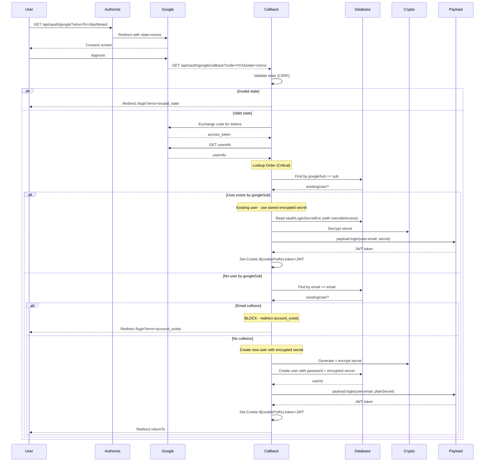

# Google OAuth Registration Implementation Plan (Strategy 2A)

## Overview

Google OAuth using **custom callback** with `payload.login()` for session tokens. Token MUST come from `payload.login()` - `/api/users/me` only validates these tokens.

---

## Architecture: Strategy 2A Flow



---

## Phase 1: Users Collection Schema

### 1.1 Schema Fields (Strategy 2A)

**File:** `src/collections/Users/index.ts`

```typescript
{
  name: 'googleSub',
  type: 'text',
  unique: true,
  sparse: true,
  index: true,
},
{
  name: 'verifiedEmail',
  type: 'text',
},
{
  name: 'registrationMethod',
  type: 'select',
  options: [
    { label: 'Google', value: 'google' },
    { label: 'Email', value: 'email' },
  ],
},
{
  name: 'registeredAt',
  type: 'date',
},
{
  name: 'googleProfile',
  type: 'group',
  fields: [
    { name: 'name', type: 'text' },
    { name: 'picture', type: 'text' },
  ],
},
{
  name: 'oauthLoginSecretEnc',
  type: 'text',
  // Encrypted secret for payload.login() - required for OAuth users
  // Server-side reads allowed via overrideAccess in callback
  access: {
    read: () => false,  // Never exposed to client
    create: () => true, // Set during OAuth user creation
    update: () => false, // Never updatable after creation
  },
},
```

### 1.2 Cookie Configuration

**File:** `src/lib/auth/constants.ts`

```typescript
import type { Payload } from 'payload'

export function getCookieName(payload: Payload): string {
  return `${payload.config.cookiePrefix}-token`
}

export const AUTH_COOKIE_OPTIONS = {
  httpOnly: true,
  secure: process.env.NODE_ENV === 'production',
  sameSite: 'lax',
  path: '/',
}

export const STATE_COOKIE_OPTIONS = {
  httpOnly: true,
  secure: process.env.NODE_ENV === 'production',
  sameSite: 'lax',
  path: '/',
  maxAge: 60 * 10, // 10 minutes - CSRF state expiry
}
```

---

## Phase 2: Encryption Utility (AES-GCM)

### 2.1 Crypto Utility

**File:** `src/lib/auth/crypto.ts`

```typescript
import { createCipheriv, createDecipheriv, randomBytes, createHash } from 'crypto'

const ENC_KEY = process.env.OAUTH_SECRET_ENC_KEY
if (!ENC_KEY || ENC_KEY.length < 32) {
  throw new Error('OAUTH_SECRET_ENC_KEY must be 32+ characters')
}

// Derive a proper 32-byte key using SHA-256
function getKey(): Buffer {
  return createHash('sha256').update(ENC_KEY).digest()
}

const ALGORITHM = 'aes-256-gcm'
const IV_LENGTH = 12
const TAG_LENGTH = 16

/**
 * Encrypt a plain text secret using AES-256-GCM.
 * Returns: iv + authTag + ciphertext (base64 encoded)
 */
export function encrypt(plain: string): string {
  const key = getKey()
  const iv = randomBytes(IV_LENGTH)
  const cipher = createCipheriv(ALGORITHM, key, iv)

  let encrypted = cipher.update(plain, 'utf8', 'base64')
  encrypted += cipher.final('base64')

  const authTag = cipher.getAuthTag()

  // Combine: iv + authTag + ciphertext
  const combined = Buffer.concat([iv, authTag, Buffer.from(encrypted, 'base64')])

  return combined.toString('base64')
}

/**
 * Decrypt an encrypted secret.
 * Format: iv + authTag + ciphertext (base64 encoded)
 */
export function decrypt(encrypted: string): string {
  const key = getKey()
  const combined = Buffer.from(encrypted, 'base64')

  // Extract components
  const iv = combined.subarray(0, IV_LENGTH)
  const authTag = combined.subarray(IV_LENGTH, IV_LENGTH + TAG_LENGTH)
  const ciphertext = combined.subarray(IV_LENGTH + TAG_LENGTH)

  const decipher = createDecipheriv(ALGORITHM, key, iv)
  decipher.setAuthTag(authTag)

  let decrypted = decipher.update(ciphertext)
  decrypted = Buffer.concat([decrypted, decipher.final()])

  return decrypted.toString('utf8')
}

/**
 * Generate a cryptographically secure random secret.
 */
export function generateSecret(): string {
  return randomBytes(32).toString('base64url')
}
```

---

## Phase 3: Utilities

### 3.1 Cookie Helpers

**File:** `src/lib/auth/cookies.ts`

```typescript
import type { NextRequest, NextResponse } from 'next/server'
import { AUTH_COOKIE_OPTIONS, STATE_COOKIE_OPTIONS } from './constants'
import { getCookieName } from './constants'

export function readCookie(req: NextRequest, name: string): string | undefined {
  return req.cookies.get(name)?.value
}

export function deleteCookie(res: NextResponse, name: string): void {
  res.cookies.delete(name)
}

export function setAuthCookie(res: NextResponse, payload: any, value: string): void {
  const cookieName = getCookieName(payload)
  res.cookies.set(cookieName, value, AUTH_COOKIE_OPTIONS)
}

export function setShortLivedCookie(res: NextResponse, name: string, value: string): void {
  res.cookies.set(name, value, STATE_COOKIE_OPTIONS)
}
```

### 3.2 Generate Nonce

**File:** `src/lib/auth/nonce.ts`

```typescript
export async function generateNonce(): Promise<string> {
  const bytes = new Uint8Array(16)
  crypto.getRandomValues(bytes)
  return Array.from(bytes, (b) => b.toString(16).padStart(2, '0')).join('')
}
```

### 3.3 Sanitize ReturnTo

**File:** `src/lib/auth/sanitize-return-to.ts`

```typescript
export function sanitizeReturnTo(returnTo: string | undefined): string {
  const defaultRedirect = '/'
  if (!returnTo) return defaultRedirect

  const trimmed = returnTo.trim()

  if (
    trimmed.startsWith('//') ||
    trimmed.match(/^https?:\/\//i) ||
    trimmed.match(/^(data|javascript|mailto):/i)
  ) {
    return defaultRedirect
  }

  if (!trimmed.startsWith('/')) return defaultRedirect

  return trimmed
}
```

### 3.4 Structured Logger

**File:** `src/lib/auth/logger.ts`

```typescript
import { logger } from '@/lib/logger'

async function hashEmail(email: string): Promise<string> {
  const crypto = await import('crypto')
  return crypto.createHash('sha256').update(email).digest('hex')
}

export async function logOAuthEvent(
  event: 'collision' | 'user_created' | 'user_updated' | 'session_issued' | 'error',
  data: Record<string, unknown>,
): Promise<void> {
  const safeData: Record<string, unknown> = {
    event: `oauth_${event}`,
    correlationId: data.correlationId,
    timestamp: new Date().toISOString(),
  }

  if (data.email) {
    safeData.emailHash = await hashEmail(data.email as string)
  }

  if (data.googleSub) safeData.googleSub = data.googleSub
  if (data.userId) safeData.userId = data.userId

  logger.info(safeData)
}

export function logOAuthError(errorType: string, error: unknown, correlationId: string): void {
  logger.error({
    event: `oauth_error_${errorType}`,
    correlationId,
    timestamp: new Date().toISOString(),
    error: error instanceof Error ? error.message : String(error),
  })
}
```

### 3.5 Canonical URL Builder

**File:** `src/lib/auth/get-public-base-url.ts`

```typescript
import type { NextRequest } from 'next/server'

export function getPublicBaseUrl(req: NextRequest): string {
  const forwardedProto = req.headers.get('x-forwarded-proto')
  const forwardedHost = req.headers.get('x-forwarded-host')

  if (forwardedProto && forwardedHost) {
    return `${forwardedProto}://${forwardedHost}`
  }

  return req.nextUrl.origin
}
```

---

## Phase 4: Session Creation

### 4.1 Session Issuance via payload.login()

**File:** `src/lib/auth/issue-session.ts`

```typescript
import { getPayload } from 'payload'
import config from '@payload-config'
import { decrypt } from './crypto'

export interface SessionResult {
  token: string
}

/**
 * Issue a valid Payload auth session using payload.login().
 *
 * For existing OAuth users:
 * - Decrypt the stored oauthLoginSecretEnc
 * - Use it with payload.login() to get a token
 *
 * @param email - User's stored email (from DB, not Google)
 * @param encryptedSecret - The oauthLoginSecretEnc value
 * @returns Session token
 */
export async function issueSession(email: string, encryptedSecret: string): Promise<SessionResult> {
  const payload = await getPayload({ config })

  // Decrypt the stored secret
  const plainSecret = decrypt(encryptedSecret)

  // Use payload.login() - this is the ONLY way /api/users/me validates tokens
  const loginResult = await payload.login({
    collection: 'users',
    data: {
      email,
      password: plainSecret,
    },
  })

  if (!loginResult || !('token' in loginResult) || !loginResult.token) {
    throw new Error('Session issuance failed: no token returned')
  }

  return { token: loginResult.token }
}

/**
 * Issue session for newly created OAuth user (we have the plain secret).
 */
export async function issueSessionWithPlainSecret(
  email: string,
  plainSecret: string,
): Promise<SessionResult> {
  const payload = await getPayload({ config })

  const loginResult = await payload.login({
    collection: 'users',
    data: {
      email,
      password: plainSecret,
    },
  })

  if (!loginResult || !('token' in loginResult) || !loginResult.token) {
    throw new Error('Session issuance failed: no token returned')
  }

  return { token: loginResult.token }
}
```

---

## Phase 5: CSRF Protection

### 5.1 OAuth State Management

**File:** `src/lib/auth/oauth-state.ts`

```typescript
import type { NextRequest, NextResponse } from 'next/server'
import { generateNonce } from './nonce'
import { readCookie, deleteCookie, setShortLivedCookie } from './cookies'
import { sanitizeReturnTo } from './sanitize-return-to'

const STATE_COOKIE = 'oauth_state'
const RETURN_TO_COOKIE = 'oauth_return_to'

export async function storeOAuthState(res: NextResponse, returnTo: string): Promise<string> {
  const sanitizedReturnTo = sanitizeReturnTo(returnTo)
  setShortLivedCookie(res, RETURN_TO_COOKIE, sanitizedReturnTo)

  const state = await generateNonce()
  setShortLivedCookie(res, STATE_COOKIE, state)

  return state
}

export function validateOAuthState(
  req: NextRequest,
  res: NextResponse,
  state: string | null,
): { valid: boolean; returnTo: string } {
  const storedState = readCookie(req, STATE_COOKIE)

  const valid = storedState === state && state !== null && state !== undefined

  const returnTo = valid ? readCookie(req, RETURN_TO_COOKIE) || '/' : '/'

  deleteCookie(res, STATE_COOKIE)
  deleteCookie(res, RETURN_TO_COOKIE)

  return { valid, returnTo }
}
```

---

## Phase 6: Custom Callback Endpoint

### 6.1 Authorize Redirect

**File:** `src/app/api/oauth/google/route.ts`

```typescript
import { NextRequest, NextResponse } from 'next/server'
import { storeOAuthState } from '@/lib/auth/oauth-state'
import { sanitizeReturnTo } from '@/lib/auth/sanitize-return-to'
import { getPublicBaseUrl } from '@/lib/auth/get-public-base-url'

const GOOGLE_AUTH_URL = 'https://accounts.google.com/o/oauth2/v2/auth'

export async function GET(req: NextRequest): Promise<NextResponse> {
  const returnTo = sanitizeReturnTo(req.nextUrl.searchParams.get('returnTo'))

  const baseUrl = getPublicBaseUrl(req)
  const callbackUrl = `${baseUrl}/api/oauth/google/callback`

  const authUrl = new URL(GOOGLE_AUTH_URL)
  authUrl.searchParams.set('client_id', process.env.GOOGLE_CLIENT_ID!)
  authUrl.searchParams.set('redirect_uri', callbackUrl)
  authUrl.searchParams.set('response_type', 'code')
  authUrl.searchParams.set(
    'scope',
    'https://www.googleapis.com/auth/userinfo.email https://www.googleapis.com/auth/userinfo.profile',
  )

  const res = NextResponse.redirect(authUrl)
  const state = await storeOAuthState(res, returnTo)

  authUrl.searchParams.set('state', state)
  res.headers.set('Location', authUrl.toString())

  return res
}
```

### 6.2 Callback - Strategy 2A (payload.login() only)

**File:** `src/app/api/oauth/google/callback/route.ts`

```typescript
import { NextRequest, NextResponse } from 'next/server'
import { getPayload } from 'payload'
import config from '@payload-config'
import { validateOAuthState } from '@/lib/auth/oauth-state'
import { issueSession, issueSessionWithPlainSecret } from '@/lib/auth/issue-session'
import { setAuthCookie } from '@/lib/auth/cookies'
import { logOAuthEvent, logOAuthError } from '@/lib/auth/logger'
import { getPublicBaseUrl } from '@/lib/auth/get-public-base-url'
import { generateSecret, encrypt } from '@/lib/auth/crypto'

export async function GET(req: NextRequest): Promise<NextResponse> {
  const payload = await getPayload({ config })
  const { searchParams } = new URL(req.url)
  const code = searchParams.get('code')
  const state = searchParams.get('state')
  const correlationId = crypto.randomUUID()

  const res = NextResponse.redirect(new URL('/login', req.url))

  // STEP 1: CSRF Protection
  const { valid: stateValid, returnTo } = validateOAuthState(req, res, state)

  if (!stateValid) {
    res.headers.set('Location', new URL('/login?error=invalid_state', req.url).toString())
    return res
  }

  if (!code) {
    res.headers.set('Location', new URL('/login?error=missing_code', req.url).toString())
    return res
  }

  // STEP 2: Exchange code for tokens
  const tokenResponse = await fetch('https://oauth2.googleapis.com/token', {
    method: 'POST',
    headers: { 'Content-Type': 'application/x-www-form-urlencoded' },
    body: new URLSearchParams({
      code,
      client_id: process.env.GOOGLE_CLIENT_ID!,
      client_secret: process.env.GOOGLE_CLIENT_SECRET!,
      redirect_uri: `${getPublicBaseUrl(req)}/api/oauth/google/callback`,
      grant_type: 'authorization_code',
    }),
  })

  if (!tokenResponse.ok) {
    logOAuthError('token_exchange_failed', 'token exchange failed', correlationId)
    res.headers.set('Location', new URL('/login?error=token_exchange_failed', req.url).toString())
    return res
  }

  const tokenData = await tokenResponse.json()
  if (!tokenData.access_token) {
    res.headers.set('Location', new URL('/login?error=token_exchange_failed', req.url).toString())
    return res
  }

  // STEP 3: Fetch userinfo
  const userinfoResponse = await fetch('https://www.googleapis.com/oauth2/v3/userinfo', {
    headers: { Authorization: `Bearer ${tokenData.access_token}` },
  })

  if (!userinfoResponse.ok) {
    logOAuthError('userinfo_failed', 'userinfo request failed', correlationId)
    res.headers.set('Location', new URL('/login?error=userinfo_failed', req.url).toString())
    return res
  }

  const userinfo = await userinfoResponse.json()
  const { sub, email, email_verified, name, picture } = userinfo

  if (!sub || !email) {
    res.headers.set('Location', new URL('/login?error=invalid_userinfo', req.url).toString())
    return res
  }

  // STEP 4: Email Verification
  if (email_verified !== true) {
    res.headers.set('Location', new URL('/login?error=email_not_verified', req.url).toString())
    return res
  }

  // STEP 5: Lookup Order (Critical)

  // D.1: Find by googleSub - MUST use overrideAccess to read oauthLoginSecretEnc
  const existingByGoogleSub = await payload.find({
    collection: 'users',
    where: { googleSub: { equals: sub } },
    limit: 1,
    overrideAccess: true, // Required to read oauthLoginSecretEnc (access.read: false)
  })

  if (existingByGoogleSub.docs.length > 0) {
    // Existing OAuth user - use stored encrypted secret
    const user = existingByGoogleSub.docs[0]

    // Verify oauthLoginSecretEnc exists and is readable
    if (!user.oauthLoginSecretEnc) {
      logOAuthError('user_missing_oauth_secret', 'OAuth user missing stored secret', correlationId)
      res.headers.set('Location', new URL('/login?error=auth_error', req.url).toString())
      return res
    }

    // Update profile only (name/picture from Google)
    await payload.update({
      collection: 'users',
      id: user.id,
      data: { googleProfile: { name, picture } },
    })

    logOAuthEvent('user_updated', { correlationId, userId: user.id, googleSub: sub })

    // Issue session using stored encrypted secret
    // CRITICAL: Use user.email (from DB), NOT userinfo.email (Google may change)
    try {
      const { token } = await issueSession(user.email, user.oauthLoginSecretEnc)
      res.headers.set('Location', new URL(returnTo, req.url).toString())
      setAuthCookie(res, payload, token)
      return res
    } catch (error) {
      logOAuthError('session_issuance_failed', error, correlationId)
      res.headers.set('Location', new URL('/login?error=session_issue_failed', req.url).toString())
      return res
    }
  }

  // D.2: Find by email - COLLISION CHECK
  const existingByEmail = await payload.find({
    collection: 'users',
    where: { email: { equals: email } },
    limit: 1,
  })

  if (existingByEmail.docs.length > 0) {
    // COLLISION - BLOCK (no linking, no mutation)
    const existingUser = existingByEmail.docs[0]
    const googleSubMissing =
      existingUser.googleSub === null ||
      existingUser.googleSub === undefined ||
      existingUser.googleSub === ''

    if (googleSubMissing || existingUser.googleSub !== sub) {
      logOAuthEvent('collision', { correlationId, email, googleSub: sub })
      res.headers.set('Location', new URL('/login?error=account_exists', req.url).toString())
      return res
    }
  }

  // D.3: Create new user with encrypted secret
  let userId: string
  const plainSecret = generateSecret()
  const encryptedSecret = encrypt(plainSecret)

  try {
    const newUser = await payload.create({
      collection: 'users',
      data: {
        email,
        googleSub: sub,
        verifiedEmail: email,
        registeredAt: new Date().toISOString(),
        registrationMethod: 'google',
        googleProfile: { name, picture },
        name: name || email.split('@')[0],
        password: plainSecret, // Payload hashes this
        oauthLoginSecretEnc: encryptedSecret, // Encrypted for future logins
      },
    })
    userId = newUser.id
    logOAuthEvent('user_created', { correlationId, userId, googleSub: sub })
  } catch (error: any) {
    // Race condition: another request created the user first
    const isDuplicateKey =
      error?.code === 11000 ||
      error?.name === 'MongoServerError' ||
      (error?.message && error.message.includes('E11000'))

    if (isDuplicateKey) {
      // Fall back to finding by googleSub with overrideAccess
      const retryUser = await payload.find({
        collection: 'users',
        where: { googleSub: { equals: sub } },
        limit: 1,
        overrideAccess: true, // Must read oauthLoginSecretEnc
      })

      if (retryUser.docs.length > 0) {
        const user = retryUser.docs[0]

        // Edge case: user exists but oauthLoginSecretEnc not set
        if (!user.oauthLoginSecretEnc) {
          logOAuthError(
            'race_recovery_missing_secret',
            'Race recovery failed: secret not set',
            correlationId,
          )
          res.headers.set('Location', new URL('/login?error=auth_error', req.url).toString())
          return res
        }

        userId = user.id
        logOAuthEvent('user_created_race_recovery', { correlationId, userId, googleSub: sub })
      } else {
        logOAuthError('user_creation_race_failed', 'race recovery failed', correlationId)
        res.headers.set(
          'Location',
          new URL('/login?error=user_creation_failed', req.url).toString(),
        )
        return res
      }
    } else {
      logOAuthError('user_creation_failed', error, correlationId)
      throw error
    }
  }

  // Issue session using the plain secret we just set
  try {
    const { token } = await issueSessionWithPlainSecret(email, plainSecret)
    res.headers.set('Location', new URL(returnTo, req.url).toString())
    setAuthCookie(res, payload, token)
    return res
  } catch (error) {
    logOAuthError('session_issuance_failed', error, correlationId)
    res.headers.set('Location', new URL('/login?error=session_issue_failed', req.url).toString())
    return res
  }
}
```

---

## Phase 7: Registration Gate (Global Enforcement)

### 7.1 Protected Layout (FIXED - uses getMeUser)

**File:** `src/app/(frontend)/(protected)/layout.tsx`

```typescript
import { redirect } from 'next/navigation'
import { getMeUser } from '@/utilities/getMeUser'

export default async function ProtectedLayout({
  children,
}: {
  children: React.ReactNode
}) {
  // Use the existing getMeUser utility - handles forwarded headers correctly
  const { user } = await getMeUser({
    nullUserRedirect: '/login',
  })

  if (!user) {
    // getMeUser already redirected to /login if no token
    return null
  }

  // Check registration requirements
  const isRegistered =
    user.registeredAt !== undefined &&
    user.registeredAt !== null &&
    user.verifiedEmail !== undefined &&
    user.verifiedEmail !== null &&
    user.verifiedEmail !== '' &&
    user.registrationMethod === 'google'

  if (!isRegistered) {
    // Authenticated but not fully registered
    redirect('/register')
  }

  return <>{children}</>
}
```

### 7.2 Middleware

**File:** `src/middleware.ts`

```typescript
import { NextResponse } from 'next/server'
import type { NextRequest } from 'next/server'

// Use env for cookie prefix to match getCookieName()
const AUTH_COOKIE_PREFIX = process.env.PAYLOAD_COOKIE_PREFIX || 'payload'

const PROTECTED_PATHS = ['/dashboard', '/courses', '/lessons', '/profile']

export async function middleware(req: NextRequest): Promise<NextResponse | undefined> {
  const path = req.nextUrl.pathname

  const isProtectedPath = PROTECTED_PATHS.some((p) => path.startsWith(p))
  if (!isProtectedPath) {
    return NextResponse.next()
  }

  // FIXED: Use exact cookie name
  const authCookieName = `${AUTH_COOKIE_PREFIX}-token`
  const hasAuthCookie = req.cookies.get(authCookieName)?.value !== undefined

  if (!hasAuthCookie) {
    return NextResponse.redirect(new URL('/login', req.url))
  }

  return NextResponse.next()
}

export const config = {
  matcher: ['/((?!_next/static|_next/image|favicon.ico|public|api|_payload).*)'],
}
```

---

## Phase 8: Environment Configuration

**File:** `.env.example`

```bash
GOOGLE_CLIENT_ID=your-google-client-id
GOOGLE_CLIENT_SECRET=your-google-client-secret
PAYLOAD_SECRET=your-secret
# Encryption key for OAuth login secrets (32+ chars, separate from PAYLOAD_SECRET)
# Use a strong random string, e.g., from: openssl rand -base64 32
OAUTH_SECRET_ENC_KEY=your-32-char-or-longer-encryption-key-here
# PAYLOAD_COOKIE_PREFIX=your-prefix
```

---

## Phase 9: Tests

### 9.1 Session E2E Test

**File:** `tests/int/auth/session.spec.ts`

```typescript
import { getCookieName } from '@/lib/auth/constants'

describe('Session creation E2E', () => {
  it('sets auth cookie and /api/users/me works immediately', async () => {
    const payload = await getPayload({ config: testPayloadConfig })
    const cookieName = getCookieName(payload)

    mockGoogleUserinfo({
      sub: 'google-session-test',
      email: 'session@example.com',
      email_verified: true,
    })

    const authorizeRes = await fetch(`${baseUrl}/api/oauth/google?returnTo=/dashboard`)
    const cookies = authorizeRes.headers.get('Set-Cookie')
    const state = extractState(cookies)

    const callbackRes = await fetch(
      `${baseUrl}/api/oauth/google/callback?code=mock&state=${state}`,
      { headers: { Cookie: cookies || '' }, redirect: 'manual' },
    )

    const setCookie = callbackRes.headers.get('Set-Cookie')
    expect(setCookie).toBeDefined()
    expect(setCookie).toContain(cookieName)

    // CRITICAL: /api/users/me must return 200
    const meResponse = await fetch(`${baseUrl}/api/users/me`, {
      headers: { Cookie: setCookie || '' },
    })

    expect(meResponse.status).toBe(200)
    const user = await meResponse.json()
    expect(user.googleSub).toBe('google-session-test')
  })
})
```

### 9.2 Collision Test

**File:** `tests/int/auth/collision.spec.ts`

```typescript
describe('Collision detection', () => {
  it('blocks existing email user with different googleSub', async () => {
    // Create user by email (no googleSub)
    await createEmailUser({
      email: 'collision@example.com',
      password: 'password123',
    })

    mockGoogleUserinfo({
      sub: 'google-collision-sub',
      email: 'collision@example.com', // Same email, different sub
      email_verified: true,
    })

    const authorizeRes = await fetch(`${baseUrl}/api/oauth/google?returnTo=/dashboard`)
    const cookies = authorizeRes.headers.get('Set-Cookie')
    const state = extractState(cookies)

    const callbackRes = await fetch(
      `${baseUrl}/api/oauth/google/callback?code=mock&state=${state}`,
      { headers: { Cookie: cookies || '' }, redirect: 'manual' },
    )

    // Should redirect to account_exists
    expect(callbackRes.redirected).toBe(true)
    expect(callbackRes.url).toContain('error=account_exists')

    // Verify no mutation occurred
    const userAfter = await getUserByEmail('collision@example.com')
    expect(userAfter.googleSub).toBeUndefined()
    expect(userAfter.password).toBeDefined() // Original password unchanged
  })
})
```

### 9.3 Existing OAuth User Login Test

**File:** `tests/int/auth/existing-user.spec.ts`

```typescript
describe('Existing OAuth user login', () => {
  it('succeeds without changing password hash', async () => {
    // Create OAuth user
    const { id, oauthLoginSecretEnc } = await createOAuthUser({
      email: 'existing@example.com',
      googleSub: 'google-existing',
    })

    // Get original password hash
    const originalHash = await getPasswordHash(id)

    mockGoogleUserinfo({
      sub: 'google-existing',
      email: 'existing@example.com',
      email_verified: true,
    })

    const authorizeRes = await fetch(`${baseUrl}/api/oauth/google?returnTo=/dashboard`)
    const cookies = authorizeRes.headers.get('Set-Cookie')
    const state = extractState(cookies)

    await fetch(`${baseUrl}/api/oauth/google/callback?code=mock&state=${state}`, {
      headers: { Cookie: cookies || '' },
      redirect: 'manual',
    })

    // Verify password hash unchanged
    const hashAfter = await getPasswordHash(id)
    expect(hashAfter).toBe(originalHash)

    // Verify session works
    const meResponse = await fetch(`${baseUrl}/api/users/me`, {
      headers: { Cookie: cookies || '' },
    })
    expect(meResponse.status).toBe(200)
  })

  it('existing user can login (oauthLoginSecretEnc readable server-side)', async () => {
    // Create OAuth user
    const { id } = await createOAuthUser({
      email: 'oauth-login@example.com',
      googleSub: 'google-oauth-login',
    })

    mockGoogleUserinfo({
      sub: 'google-oauth-login',
      email: 'oauth-login@example.com',
      email_verified: true,
    })

    const authorizeRes = await fetch(`${baseUrl}/api/oauth/google?returnTo=/dashboard`)
    const cookies = authorizeRes.headers.get('Set-Cookie')
    const state = extractState(cookies)

    const callbackRes = await fetch(
      `${baseUrl}/api/oauth/google/callback?code=mock&state=${state}`,
      { headers: { Cookie: cookies || '' }, redirect: 'manual' },
    )

    // Should succeed
    expect(callbackRes.redirected).toBe(true)
    expect(callbackRes.url).not.toContain('error=')

    // Verify session works
    const setCookie = callbackRes.headers.get('Set-Cookie')
    const meResponse = await fetch(`${baseUrl}/api/users/me`, {
      headers: { Cookie: setCookie || '' },
    })
    expect(meResponse.status).toBe(200)
  })
})
```

### 9.4 No Secret Leak Test

**File:** `tests/int/auth/no-secret-leak.spec.ts`

```typescript
describe('No plaintext secret leak', () => {
  it('oauthLoginSecretEnc is not readable via API', async () => {
    const { id } = await createOAuthUser({
      email: 'secret-test@example.com',
      googleSub: 'google-secret-test',
    })

    // Try to read user via API (client would get 403 or field omitted)
    const user = await getUserById(id)

    // oauthLoginSecretEnc should not be returned
    expect(user.oauthLoginSecretEnc).toBeUndefined()
  })

  it('encryption produces authenticated ciphertext', async () => {
    const plain = 'test-secret'
    const encrypted = encrypt(plain)

    // Verify it's not plaintext
    expect(encrypted).not.toBe(plain)

    // Decrypt and verify
    const decrypted = decrypt(encrypted)
    expect(decrypted).toBe(plain)

    // Verify tamper detection by modifying
    const tampered = encrypted.slice(0, -4) + 'XXXX'
    expect(() => decrypt(tampered)).toThrow()
  })

  it('key derivation produces consistent 32-byte key', async () => {
    // Test that the same key produces same encryption
    const plain = 'test'
    const encrypted1 = encrypt(plain)
    const encrypted2 = encrypt(plain)

    // Same plaintext should produce different ciphertext (random IV)
    expect(encrypted1).not.toBe(encrypted2)

    // But both should decrypt to same value
    expect(decrypt(encrypted1)).toBe(plain)
    expect(decrypt(encrypted2)).toBe(plain)
  })
})
```

---

## Implementation Order

```
Phase 1: Schema + DB Index Migration (add oauthLoginSecretEnc)
    ↓
Phase 2: Crypto Utility (AES-GCM with proper key derivation)
    ↓
Phase 3: Constants + Utilities (cookies, nonce, logger, canonical URL)
    ↓
Phase 4: Session Creation (payload.login with decrypted secret)
    ↓
Phase 5: CSRF Protection (OAuth state)
    ↓
Phase 6: Custom Callback (Strategy 2A lookup order, overrideAccess)
    ↓
Phase 7: Registration Gate (protected layout - uses getMeUser)
    ↓
Phase 8: Environment Configuration
    ↓
Phase 9: Tests (Hard Stop: /api/users/me = 200, no secret leak)
```

---

## HARD STOP CHECKLIST

- [ ] OAuth callback sets auth cookie using `payload.login()`
- [ ] `/api/users/me` returns 200 immediately (NOT 401)
- [ ] Collision test: existing email user → redirect `account_exists`, no mutation
- [ ] Existing OAuth user login: succeeds (oauthLoginSecretEnc readable via overrideAccess)
- [ ] Cookie name from `payload.config.cookiePrefix` everywhere
- [ ] `oauthLoginSecretEnc` is NOT readable via API (access.read: false)
- [ ] No plaintext secret stored anywhere
- [ ] Registration gate enforced at protected layout level (uses getMeUser)
- [ ] No hardcoded localhost in auth verification
- [ ] No PII in logs (email hashed, no tokens)

---

## Output Artifacts

| Artifact              | File Path                                                        |
| --------------------- | ---------------------------------------------------------------- |
| Users schema          | `src/collections/Users/index.ts`                                 |
| DB migration          | `src/collections/Users/migrations/add-googleSub-unique-index.ts` |
| Encryption utility    | `src/lib/auth/crypto.ts`                                         |
| Constants             | `src/lib/auth/constants.ts`                                      |
| Cookie helpers        | `src/lib/auth/cookies.ts`                                        |
| Nonce generator       | `src/lib/auth/nonce.ts`                                          |
| Sanitize utility      | `src/lib/auth/sanitize-return-to.ts`                             |
| Logger (PII-safe)     | `src/lib/auth/logger.ts`                                         |
| Canonical URL builder | `src/lib/auth/get-public-base-url.ts`                            |
| Session creation      | `src/lib/auth/issue-session.ts`                                  |
| OAuth state           | `src/lib/auth/oauth-state.ts`                                    |
| Authorize route       | `src/app/api/oauth/google/route.ts`                              |
| Callback route        | `src/app/api/oauth/google/callback/route.ts`                     |
| Protected layout      | `src/app/(frontend)/(protected)/layout.tsx`                      |
| Middleware            | `src/middleware.ts`                                              |
| Env example           | `.env.example`                                                   |
| Test files            | `tests/int/auth/*.spec.ts`                                       |
