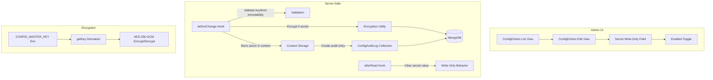
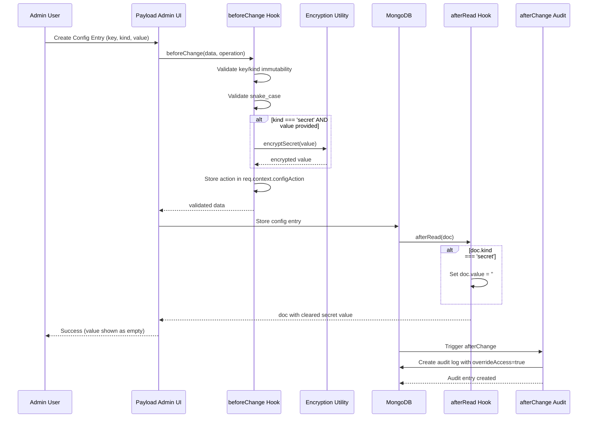

# Low-Level Plan: Global Config Key/Value Manager

## Overview

This document provides a detailed implementation plan for a minimal admin-managed configuration store in Payload CMS with:

- Single global key/value table (`ConfigEntries`)
- Encryption for secrets only
- Audit logging (`ConfigAuditLog`)
- Comprehensive automated tests

## Project Standards Compliance

This plan adheres to:

- **AGENTS.md** - Payload CMS development rules (TypeScript-first, transaction safety, access control)
- **Collection patterns** from `src/server/payload/collections/` (adminOnly access, hook patterns)
- **Encryption pattern** from `src/infra/auth/oauth_crypto.ts` (AES-256-GCM)
- **Testing patterns** from `tests/README.md` (Vitest integration tests)

---

## Architecture



---

## File Structure

```
src/
├── server/
│   └── payload/
│       ├── collections/
│       │   ├── ConfigEntries.ts         # Main collection with afterRead hook
│       │   └── ConfigAuditLogs.ts       # Audit log collection
│       ├── access/
│       │   └── configAdminOnly.ts       # Access control for config
│       └── hooks/
│           └── configEntries/
│               ├── beforeChange-hook.ts # Encryption + validation
│               └── afterChange-hook.ts  # Audit logging
├── lib/
│   └── config/
│       ├── config-crypto.ts             # Encryption utilities
│       └── config-constants.ts          # Kind enum, guard patterns
tests/
├── int/
│   └── config-manager.int.spec.ts       # Integration tests
└── unit/
    └── lib/
        └── config/
            └── config-crypto.spec.ts    # Unit tests for crypto
.env.example                           # Add CONFIG_MASTER_KEY
payload.config.ts                       # Register collections
payload-types.ts                        # Generated after types
```

---

## Step-by-Step Implementation

### Step 1: Create Constants and Types

**File:** `src/lib/config/config-constants.ts`

```typescript
/**
 * Config Constants
 *
 * @fileType utility
 * @domain config
 * @pattern constants
 * @ai-summary Configuration constants for the config manager
 */

/**
 * Kind enum for config entry types
 */
export const ConfigKind = {
  Variable: 'variable',
  Secret: 'secret',
} as const

export type ConfigKind = (typeof ConfigKind)[keyof typeof ConfigKind]

/**
 * Action enum for audit log entries
 */
export const ConfigAction = {
  Created: 'created',
  Updated: 'updated',
  Enabled: 'enabled',
  Disabled: 'disabled',
} as const

export type ConfigAction = (typeof ConfigAction)[keyof typeof ConfigAction]

/**
 * Secret-like key patterns to block for variables
 * Prevents accidental storage of secrets as variables
 */
export const SECRET_KEY_PATTERNS = [
  /secret/i,
  /token/i,
  /apikey/i,
  /api_key/i,
  /password/i,
  /private/i,
  /credential/i,
  /key$/i,
]

/**
 * Validates that a key is in snake_case
 */
export function isSnakeCase(key: string): boolean {
  return /^[a-z][a-z0-9]*(_[a-z0-9]+)*$/.test(key)
}

/**
 * Check if a key looks like it should be a secret
 */
export function looksLikeSecret(key: string): boolean {
  return SECRET_KEY_PATTERNS.some((pattern) => pattern.test(key))
}
```

**Acceptance Criteria:**

- [ ] `ConfigKind` enum with `variable` and `secret` values
- [ ] `ConfigAction` enum with all action types
- [ ] `isSnakeCase()` function validates snake_case format
- [ ] `looksLikeSecret()` detects secret-like patterns
- [ ] `SECRET_KEY_PATTERNS` array for regex patterns

---

### Step 2: Create Encryption Utility

**File:** `src/lib/config/config-crypto.ts`

```typescript
/**
 * Config Encryption Utility
 *
 * @fileType utility
 * @domain config
 * @pattern encryption
 * @ai-summary AES-256-GCM encryption for config secrets
 */

import { createCipheriv, createDecipheriv, randomBytes, createHash } from 'crypto'

/**
 * Derive a 32-byte key from CONFIG_MASTER_KEY
 * Throws if env var is not set
 */
function getKey(): Buffer {
  const key = process.env.CONFIG_MASTER_KEY
  if (!key || key.length < 32) {
    throw new Error(
      'CONFIG_MASTER_KEY environment variable must be set and be at least 32 characters',
    )
  }
  return createHash('sha256').update(key).digest()
}

const ALGORITHM = 'aes-256-gcm'
const IV_LENGTH = 12
const TAG_LENGTH = 16

/**
 * Encrypt a plain text secret using AES-256-GCM.
 * Returns: iv + authTag + ciphertext (base64 encoded)
 *
 * @param plain - Plain text to encrypt
 * @returns Base64 encoded encrypted value
 * @throws Error if encryption fails
 */
export function encryptSecret(plain: string): string {
  const key = getKey()
  const iv = randomBytes(IV_LENGTH)
  // eslint-disable-next-line @typescript-eslint/no-explicit-any
  const cipher = createCipheriv(ALGORITHM, key as any, iv as any)

  let encrypted = cipher.update(plain, 'utf8', 'base64')
  encrypted += cipher.final('base64')

  const authTag = cipher.getAuthTag()

  // Combine: iv + authTag + ciphertext
  const combined = Buffer.concat([
    // eslint-disable-next-line @typescript-eslint/no-explicit-any
    iv as any,
    // eslint-disable-next-line @typescript-eslint/no-explicit-any
    authTag as any,
    // eslint-disable-next-line @typescript-eslint/no-explicit-any
    Buffer.from(encrypted, 'base64') as any,
  ])

  return combined.toString('base64')
}

/**
 * Decrypt an encrypted secret.
 * Format: iv + authTag + ciphertext (base64 encoded)
 *
 * @param encrypted - Base64 encoded encrypted value
 * @returns Decrypted plain text
 * @throws Error if decryption fails (wrong key or corrupted data)
 */
export function decryptSecret(encrypted: string): string {
  const key = getKey()
  const combined = Buffer.from(encrypted, 'base64')

  // Extract components
  const iv = combined.subarray(0, IV_LENGTH)
  const authTag = combined.subarray(IV_LENGTH, IV_LENGTH + TAG_LENGTH)
  const ciphertext = combined.subarray(IV_LENGTH + TAG_LENGTH)

  // eslint-disable-next-line @typescript-eslint/no-explicit-any
  const decipher = createDecipheriv(ALGORITHM, key as any, iv as any)
  // eslint-disable-next-line @typescript-eslint/no-explicit-any
  decipher.setAuthTag(authTag as any)

  // eslint-disable-next-line @typescript-eslint/no-explicit-any
  let decrypted = decipher.update(ciphertext as any)
  // eslint-disable-next-line @typescript-eslint/no-explicit-any
  decrypted = Buffer.concat([decrypted as any, decipher.final() as any])

  return decrypted.toString('utf8')
}
```

**Acceptance Criteria:**

- [ ] `encryptSecret()` encrypts using AES-256-GCM with CONFIG_MASTER_KEY
- [ ] `decryptSecret()` decrypts successfully
- [ ] Throws descriptive error if CONFIG_MASTER_KEY is missing
- [ ] Uses same encryption format as `oauth_crypto.ts` for consistency

---

### Step 3: Create Access Control

**File:** `src/server/payload/access/configAdminOnly.ts`

```typescript
/**
 * Access Control for Config Collections
 *
 * @fileType access-control
 * @domain config
 * @pattern admin-only
 * @ai-summary Access control that restricts config operations to admins only
 */

import type { AccessArgs } from 'payload'
import type { User } from '@/payload-types'
import { AccountRole } from '@/server/payload/collections/Users/roles'
import { isUsersCollectionUser } from '@/server/payload/access/isUsersCollectionUser'

type ConfigAccess = (args: AccessArgs<User>) => boolean

/**
 * Access control that only allows users with role='admin'
 */
export const configAdminOnly: ConfigAccess = ({ req: { user } }) => {
  if (!isUsersCollectionUser(user)) {
    return false
  }

  return user.role === AccountRole.Admin
}
```

**Acceptance Criteria:**

- [ ] Only admins can create/read/update/delete config entries
- [ ] Non-admins receive 403 response
- [ ] Type-safe with User type from payload-types

---

### Step 4: Create ConfigEntries Collection

**File:** `src/server/payload/collections/ConfigEntries.ts`

```typescript
/**
 * ConfigEntries Collection
 *
 * @fileType collection-config
 * @domain config
 * @pattern key-value-store, encrypted-values
 * @ai-summary Config entries with encryption for secrets, audit logging, and write-only UX for secrets
 *
 * Security (CRITICAL):
 * - Admin-only access for all operations
 * - Secrets encrypted at rest in database
 * - Admin UI never shows decrypted secrets after save (write-only)
 * - Audit log tracks all mutations without leaking secrets
 */

import type { CollectionConfig } from 'payload'

import { configAdminOnly } from '../access/configAdminOnly'
import { beforeChangeEncryptAndValidate } from '../hooks/configEntries/beforeChange-hook'
import { afterChangeAuditLog } from '../hooks/configEntries/afterChange-hook'
import { afterReadHideSecretValue } from '../hooks/configEntries/afterRead-hook'
import { ConfigKind } from '@/lib/config/config-constants'

export const ConfigEntries: CollectionConfig = {
  slug: 'config_entries',
  admin: {
    useAsTitle: 'key',
    defaultColumns: ['key', 'kind', 'enabled', 'updatedAt'],
    group: 'System',
    description:
      'Global configuration key/value store. Variables are plaintext, secrets are encrypted.',
  },
  access: {
    create: configAdminOnly,
    read: configAdminOnly,
    update: configAdminOnly,
    delete: configAdminOnly,
  },
  fields: [
    {
      name: 'key',
      type: 'text',
      required: true,
      unique: true,
      index: true,
      admin: {
        description: 'Configuration key (snake_case, immutable after creation)',
      },
      validate: (value) => {
        if (!value || typeof value !== 'string') {
          return 'Key is required'
        }
        if (!/^[a-z][a-z0-9]*(_[a-z0-9]+)*$/.test(value)) {
          return 'Key must be snake_case (e.g., my_config_key)'
        }
        return true
      },
    },
    {
      name: 'kind',
      type: 'select',
      required: true,
      options: [
        { label: 'Variable', value: ConfigKind.Variable },
        { label: 'Secret', value: ConfigKind.Secret },
      ],
      defaultValue: ConfigKind.Variable,
      admin: {
        description: 'Variable: stored as plaintext. Secret: encrypted at rest.',
        position: 'sidebar',
      },
    },
    {
      name: 'value',
      type: 'text',
      required: true,
      admin: {
        description: 'Configuration value. Secrets are write-only after save.',
      },
      hooks: {
        /**
         * afterRead: Clear secret value to implement write-only UX
         */
        afterRead: [afterReadHideSecretValue],
      },
    },
    {
      name: 'enabled',
      type: 'checkbox',
      required: true,
      defaultValue: true,
      index: true,
      admin: {
        description: 'Enable or disable this configuration entry',
      },
    },
  ],
  hooks: {
    /**
     * beforeChange: Encrypt secrets, validate key/kind immutability
     * CRITICAL: Pass req to nested operations for transaction safety
     */
    beforeChange: [beforeChangeEncryptAndValidate],
    /**
     * afterChange: Create audit log entry
     * CRITICAL: Use context to prevent infinite hook loops
     */
    afterChange: [afterChangeAuditLog],
    /**
     * afterRead: Hide secret values in Admin UI responses
     */
    afterRead: [afterReadHideSecretValue],
  },
  timestamps: true,
}
```

**Acceptance Criteria:**

- [ ] Collection slug: `config_entries`
- [ ] Fields: key, kind, value, enabled
- [ ] Admin UI columns: key, kind, enabled, updatedAt (no value)
- [ ] Key validation: required, unique, snake_case
- [ ] Kind select: variable | secret
- [ ] Admin-only access for all operations
- [ ] beforeChange hook encrypts secrets and enforces immutability
- [ ] afterChange hook creates audit entries
- [ ] afterRead hook clears secret value for write-only UX

---

### Step 5: Create ConfigAuditLogs Collection

**File:** `src/server/payload/collections/ConfigAuditLogs.ts`

```typescript
/**
 * ConfigAuditLogs Collection
 *
 * @fileType collection-config
 * @domain config
 * @pattern audit-log
 * @ai-summary Append-only audit log for config mutations
 *
 * Security:
 * - create: DISABLED for UI (hooks use overrideAccess)
 * - read: admin only
 * - update: DISABLED (append-only)
 * - delete: DISABLED (append-only)
 *
 * Privacy:
 * - Secrets: Never store plaintext before/after values
 * - Variables: Store metadata only (no sensitive data)
 */

import type { CollectionConfig } from 'payload'

import { configAdminOnly } from '../access/configAdminOnly'
import { ConfigKind } from '@/lib/config/config-constants'

export const ConfigAuditLogs: CollectionConfig = {
  slug: 'config_audit_logs',
  admin: {
    useAsTitle: 'key',
    defaultColumns: ['key', 'kind', 'action', 'actor', 'createdAt'],
    group: 'System',
    description: 'Append-only audit log for config mutations. Secrets never stored in plaintext.',
  },
  access: {
    create: () => false, // Only created via hooks with overrideAccess
    read: configAdminOnly,
    update: () => false, // Append-only
    delete: () => false, // Append-only
  },
  fields: [
    {
      name: 'key',
      type: 'text',
      required: true,
      index: true,
      admin: {
        description: 'Configuration key that was modified',
      },
    },
    {
      name: 'kind',
      type: 'select',
      required: true,
      options: [
        { label: 'Variable', value: ConfigKind.Variable },
        { label: 'Secret', value: ConfigKind.Secret },
      ],
      admin: {
        description: 'Type of config entry',
      },
    },
    {
      name: 'action',
      type: 'select',
      required: true,
      options: [
        { label: 'Created', value: 'created' },
        { label: 'Updated', value: 'updated' },
        { label: 'Enabled', value: 'enabled' },
        { label: 'Disabled', value: 'disabled' },
      ],
      admin: {
        description: 'Action performed',
      },
    },
    {
      name: 'actor',
      type: 'relationship',
      relationTo: 'users',
      required: true,
      index: true,
      admin: {
        description: 'Admin user who performed the action',
      },
    },
    {
      name: 'reason',
      type: 'text',
      required: false,
      admin: {
        description: 'Optional reason for the change',
      },
    },
  ],
  timestamps: true,
}
```

**Acceptance Criteria:**

- [ ] Collection slug: `config_audit_logs`
- [ ] create: returns false (UI blocked, hooks use overrideAccess)
- [ ] update: returns false (append-only)
- [ ] delete: returns false (append-only)
- [ ] read: admin only
- [ ] Fields: key, kind, action, actor, reason, timestamps

---

### Step 6: Create Hooks

#### Step 6a: Before Change Hook

**File:** `src/server/payload/hooks/configEntries/beforeChange-hook.ts`

```typescript
/**
 * ConfigEntries Before Change Hook
 *
 * @fileType hook
 * @domain config
 * @pattern validation, encryption
 * @ai-summary Encrypts secrets and validates config entries before save
 *
 * Security (CRITICAL):
 * - Always pass req to nested operations for transaction safety
 * - Encrypt secrets before storage
 * - Enforce key and kind immutability
 * - Store computed action in req.context for audit hook
 */

import type { CollectionBeforeChangeHook } from 'payload'

import { encryptSecret } from '@/lib/config/config-crypto'
import { isSnakeCase, looksLikeSecret } from '@/lib/config/config-constants'
import { ConfigKind } from '@/lib/config/config-constants'

/**
 * Determine the action type based on operation and data
 */
function getAction(
  operation: 'create' | 'update',
  data: { enabled?: boolean; kind?: string },
  originalDoc?: { enabled?: boolean; kind?: string },
): 'created' | 'updated' | 'enabled' | 'disabled' {
  if (operation === 'create') {
    return 'created'
  }

  if (originalDoc && data.enabled !== undefined) {
    if (data.enabled && !originalDoc.enabled) {
      return 'enabled'
    }
    if (!data.enabled && originalDoc.enabled) {
      return 'disabled'
    }
  }

  return 'updated'
}

export const beforeChangeEncryptAndValidate: CollectionBeforeChangeHook = async ({
  data,
  operation,
  req,
  originalDoc,
}) => {
  const { payload } = req

  // =========================================================================
  // Key Immutability Check
  // Only compare if data.key is provided (update may omit it)
  // =========================================================================
  if (operation === 'update' && data.key !== undefined && originalDoc?.key !== data.key) {
    throw new Error('Config key cannot be changed after creation')
  }

  // =========================================================================
  // Kind Immutability Check
  // Only compare if data.kind is provided (update may omit it)
  // =========================================================================
  if (operation === 'update' && data.kind !== undefined && originalDoc?.kind !== data.kind) {
    throw new Error('Config kind cannot be changed after creation')
  }

  // =========================================================================
  // Key Format Validation (snake_case) - only on create or if key is provided
  // =========================================================================
  if (data.key && !isSnakeCase(data.key)) {
    throw new Error('Config key must be snake_case (e.g., my_config_key)')
  }

  // =========================================================================
  // Secret-Like Key Warning (soft validation)
  // =========================================================================
  if (data.kind === ConfigKind.Variable && data.key && looksLikeSecret(data.key)) {
    payload.logger.warn({
      msg: 'Config entry with variable kind has secret-like key',
      key: data.key,
      userId: req.user?.id,
    })
  }

  // =========================================================================
  // Encrypt Secrets (deterministic - always encrypt when value provided)
  // =========================================================================
  if (data.kind === ConfigKind.Secret && data.value) {
    // Always encrypt when value is provided (treat as rotation)
    // On create: always encrypt
    // On update: only encrypt if value is explicitly provided
    data.value = encryptSecret(data.value)
  }

  // =========================================================================
  // Store action in context for afterChange hook
  // =========================================================================
  req.context.configAction = getAction(operation, data, originalDoc)

  return data
}
```

**Acceptance Criteria:**

- [ ] Key immutability: throws on key change attempt (only if key provided)
- [ ] Kind immutability: throws on kind change attempt (only if kind provided)
- [ ] Key format: validates snake_case
- [ ] Secret encryption: always encrypts when value provided for secrets
- [ ] Secret-like warning: logs warning for variable with secret-like key
- [ ] Stores `configAction` in `req.context` for audit hook

#### Step 6b: After Change Hook

**File:** `src/server/payload/hooks/configEntries/afterChange-hook.ts`

```typescript
/**
 * ConfigEntries After Change Hook
 *
 * @fileType hook
 * @domain config
 * @pattern audit-log
 * @ai-summary Creates audit log entries after config mutations
 *
 * Security (CRITICAL):
 * - Always pass req to nested operations for transaction safety
 * - Never log secret values in plaintext
 * - Use context to prevent infinite hook loops
 * - Use overrideAccess to bypass collection create restriction
 */

import type { CollectionAfterChangeHook } from 'payload'

export const afterChangeAuditLog: CollectionAfterChangeHook = async ({
  doc,
  operation,
  req,
  previousDoc,
}) => {
  // Skip if we triggered this ourselves (prevent infinite loop)
  if (req.context._skipAuditLog) {
    return doc
  }

  const { payload } = req

  // Get the action from beforeChange hook (stored in context)
  const action = req.context.configAction || (operation === 'create' ? 'created' : 'updated')

  // =========================================================================
  // Create Audit Log Entry (CRITICAL: pass req for transaction safety)
  // Use overrideAccess: true to bypass collection's create: () => false
  // =========================================================================
  await payload.create({
    collection: 'config_audit_logs',
    data: {
      key: doc.key,
      kind: doc.kind,
      action: action,
      actor: req.user?.id,
      // No reason field in this implementation (can be added later)
    },
    req, // CRITICAL: Pass req for transaction safety
    overrideAccess: true, // Bypass create restriction - hooks can create
    context: {
      _skipAuditLog: true, // Prevent audit hook from triggering itself
    },
  })

  return doc
}
```

**Acceptance Criteria:**

- [ ] Creates audit log entry for all mutations
- [ ] Uses `overrideAccess: true` to bypass collection create restriction
- [ ] Passes req to payload.create for transaction safety
- [ ] Uses context to prevent infinite hook loops
- [ ] Logs actor, action, key, kind

#### Step 6c: After Read Hook (Write-Only UX)

**File:** `src/server/payload/hooks/configEntries/afterRead-hook.ts`

```typescript
/**
 * ConfigEntries After Read Hook
 *
 * @fileType hook
 * @domain config
 * @pattern write-only-ux
 * @ai-summary Clears secret values in Admin UI responses to implement write-only UX
 *
 * Security (CRITICAL):
 * - Secrets should not be revealed after save
 * - Admin must re-enter value to rotate/change
 * - Original ciphertext remains encrypted in database
 */

import type { CollectionAfterReadHook } from 'payload'

/**
 * Hide secret values in Admin UI responses
 * Called both at collection level and field level
 */
export const afterReadHideSecretValue: CollectionAfterReadHook = async ({
  doc,
  req,
  // Note: field is not available in collection-level afterRead, only field-level
}) => {
  // Only affect Admin UI responses (not API responses with overrideAccess)
  // We can check if this is an admin UI request by context or headers
  // For simplicity, we check if the doc is a secret - the Admin UI should hide it

  if (doc.kind === 'secret') {
    // Clear the value field for secrets
    // This makes the field appear empty/blank in the edit view
    // Admin must re-enter value to update
    doc.value = ''
  }

  return doc
}
```

**Acceptance Criteria:**

- [ ] Secrets return empty string for value in Admin UI
- [ ] Variables return plaintext value normally
- [ ] Database still contains encrypted value (not modified)

---

### Step 7: Register Collections in Payload Config

**File:** `src/payload.config.ts`

```typescript
// Add imports
import { ConfigEntries } from '@/server/payload/collections/ConfigEntries'
import { ConfigAuditLogs } from '@/server/payload/collections/ConfigAuditLogs'

// Add to collections array
export default buildConfig({
  // ... existing config
  collections: [
    // ... existing collections
    ConfigEntries,
    ConfigAuditLogs,
  ],
  // ... rest of config
})
```

**Acceptance Criteria:**

- [ ] Import ConfigEntries and ConfigAuditLogs
- [ ] Add to collections array

---

### Step 8: Update Environment Example

**File:** `.env.example`

```bash
# Config Manager
CONFIG_MASTER_KEY=your-32-char-minimum-master-key-here
```

**Acceptance Criteria:**

- [ ] Add CONFIG_MASTER_KEY documentation
- [ ] Document minimum length requirement

---

### Step 9: Create Integration Tests

**File:** `tests/int/config-manager.int.spec.ts`

```typescript
/**
 * Config Manager Integration Tests
 *
 * @fileType integration-test
 * @domain config
 * @pattern key-value-store, encryption, audit-log
 * @ai-summary Integration tests for config manager functionality
 */

import { describe, test, expect, beforeAll, afterAll } from 'vitest'
import { getPayload } from 'payload'
import config from '@payload-config'
import type { User } from '@/payload-types'
import { encryptSecret, decryptSecret } from '@/lib/config/config-crypto'
import { ConfigKind } from '@/lib/config/config-constants'

// Test data
const TEST_ADMIN_EMAIL = 'config-test-admin@example.com'
const TEST_ADMIN_PASSWORD = 'test-password-min-32-chars!!'
const TEST_KEY = 'test_config_key'

describe('Config Manager', () => {
  let payload: Awaited<ReturnType<typeof getPayload>>
  let adminUser: User

  beforeAll(async () => {
    payload = await getPayload({ config })

    // Create or find admin user for tests
    try {
      const users = await payload.find({
        collection: 'users',
        where: { email: { equals: TEST_ADMIN_EMAIL } },
      })
      if (users.docs.length > 0) {
        adminUser = users.docs[0]
      } else {
        adminUser = await payload.create({
          collection: 'users',
          data: {
            email: TEST_ADMIN_EMAIL,
            password: TEST_ADMIN_PASSWORD,
            role: 'admin',
          },
        })
      }
    } catch {
      // User might already exist, try to find
      const users = await payload.find({
        collection: 'users',
        where: { email: { equals: TEST_ADMIN_EMAIL } },
      })
      adminUser = users.docs[0]
    }
  })

  afterAll(async () => {
    // Cleanup test data
    try {
      await payload.delete({
        collection: 'config_entries',
        where: { key: { like: 'test_' } },
      })
      await payload.delete({
        collection: 'config_audit_logs',
        where: { key: { like: 'test_' } },
      })
    } catch {
      // Ignore cleanup errors
    }
  })

  describe('ConfigEntries Collection', () => {
    test('should create variable config entry', async () => {
      const result = await payload.create({
        collection: 'config_entries',
        data: {
          key: 'test_variable',
          kind: ConfigKind.Variable,
          value: 'plaintext-value',
          enabled: true,
        },
        req: { user: adminUser } as any,
      })

      expect(result.key).toBe('test_variable')
      expect(result.kind).toBe(ConfigKind.Variable)
      expect(result.value).toBe('plaintext-value')
      expect(result.enabled).toBe(true)
    })

    test('should create secret config entry with encryption', async () => {
      const secretValue = 'my-super-secret-password'

      const result = await payload.create({
        collection: 'config_entries',
        data: {
          key: 'test_secret',
          kind: ConfigKind.Secret,
          value: secretValue,
          enabled: true,
        },
        req: { user: adminUser } as any,
      })

      // Value should be encrypted in DB (afterRead hook returns empty string)
      expect(result.value).toBe('') // Write-only UX
      expect(result.value).not.toBe(secretValue)

      // Verify encryption by using overrideAccess to bypass afterRead
      // Or directly query and decrypt
    })

    test('should reject duplicate key', async () => {
      await expect(
        payload.create({
          collection: 'config_entries',
          data: {
            key: 'test_variable', // Already exists from previous test
            kind: ConfigKind.Variable,
            value: 'another-value',
            enabled: true,
          },
          req: { user: adminUser } as any,
        }),
      ).rejects.toThrow()
    })

    test('should reject non-snake_case key', async () => {
      await expect(
        payload.create({
          collection: 'config_entries',
          data: {
            key: 'Invalid-Key-Format',
            kind: ConfigKind.Variable,
            value: 'value',
            enabled: true,
          },
          req: { user: adminUser } as any,
        }),
      ).rejects.toThrow(/snake_case/)
    })

    test('should reject key change on update', async () => {
      // First create a config entry
      const created = await payload.create({
        collection: 'config_entries',
        data: {
          key: 'test_immutable',
          kind: ConfigKind.Variable,
          value: 'value',
          enabled: true,
        },
        req: { user: adminUser } as any,
      })

      // Try to update key
      await expect(
        payload.update({
          collection: 'config_entries',
          id: created.id,
          data: { key: 'new_key' },
          req: { user: adminUser } as any,
        }),
      ).rejects.toThrow(/cannot be changed/)
    })

    test('should reject kind change on update', async () => {
      // First create a config entry
      const created = await payload.create({
        collection: 'config_entries',
        data: {
          key: 'test_kind_immutable',
          kind: ConfigKind.Variable,
          value: 'value',
          enabled: true,
        },
        req: { user: adminUser } as any,
      })

      // Try to update kind
      await expect(
        payload.update({
          collection: 'config_entries',
          id: created.id,
          data: { kind: ConfigKind.Secret },
          req: { user: adminUser } as any,
        }),
      ).rejects.toThrow(/cannot be changed/)
    })

    test('should update enabled without sending key or kind', async () => {
      // First create a config entry
      const created = await payload.create({
        collection: 'config_entries',
        data: {
          key: 'test_update_enabled_only',
          kind: ConfigKind.Variable,
          value: 'value',
          enabled: true,
        },
        req: { user: adminUser } as any,
      })

      // Update only enabled (no key or kind)
      const updated = await payload.update({
        collection: 'config_entries',
        id: created.id,
        data: { enabled: false },
        req: { user: adminUser } as any,
      })

      expect(updated.enabled).toBe(false)
    })

    test('should update value without sending key or kind', async () => {
      // First create a config entry
      const created = await payload.create({
        collection: 'config_entries',
        data: {
          key: 'test_update_value_only',
          kind: ConfigKind.Variable,
          value: 'original',
          enabled: true,
        },
        req: { user: adminUser } as any,
      })

      // Update only value (no key or kind)
      const updated = await payload.update({
        collection: 'config_entries',
        id: created.id,
        data: { value: 'updated' },
        req: { user: adminUser } as any,
      })

      expect(updated.value).toBe('updated')
    })

    test('should toggle enabled status', async () => {
      const created = await payload.create({
        collection: 'config_entries',
        data: {
          key: 'test_toggle',
          kind: ConfigKind.Variable,
          value: 'value',
          enabled: true,
        },
        req: { user: adminUser } as any,
      })

      const disabled = await payload.update({
        collection: 'config_entries',
        id: created.id,
        data: { enabled: false },
        req: { user: adminUser } as any,
      })

      expect(disabled.enabled).toBe(false)

      const reenabled = await payload.update({
        collection: 'config_entries',
        id: created.id,
        data: { enabled: true },
        req: { user: adminUser } as any,
      })

      expect(reenabled.enabled).toBe(true)
    })
  })

  describe('Encryption', () => {
    test('encrypt produces encrypted output', () => {
      const plaintext = 'secret-data'
      const encrypted = encryptSecret(plaintext)

      expect(encrypted).toBeDefined()
      expect(typeof encrypted).toBe('string')
      expect(encrypted).not.toBe(plaintext)
    })

    test('round-trip preserves data', () => {
      const testValues = [
        'simple',
        'with spaces',
        'special-chars!@#$%',
        'unicode: עברית',
        'multi\nline',
      ]

      for (const value of testValues) {
        const encrypted = encryptSecret(value)
        const decrypted = decryptSecret(encrypted)
        expect(decrypted).toBe(value)
      }
    })
  })

  describe('ConfigAuditLogs Collection', () => {
    test('should create audit log on create', async () => {
      await payload.create({
        collection: 'config_entries',
        data: {
          key: 'test_audit_create',
          kind: ConfigKind.Variable,
          value: 'value',
          enabled: true,
        },
        req: { user: adminUser } as any,
      })

      const logs = await payload.find({
        collection: 'config_audit_logs',
        where: { key: { equals: 'test_audit_create' } },
        sort: '-createdAt',
        limit: 1,
      })

      expect(logs.docs.length).toBeGreaterThan(0)
      expect(logs.docs[0].action).toBe('created')
      expect(logs.docs[0].actor).toBe(adminUser.id)
    })

    test('should create audit log on update', async () => {
      const created = await payload.create({
        collection: 'config_entries',
        data: {
          key: 'test_audit_update',
          kind: ConfigKind.Variable,
          value: 'original',
          enabled: true,
        },
        req: { user: adminUser } as any,
      })

      await payload.update({
        collection: 'config_entries',
        id: created.id,
        data: { value: 'updated' },
        req: { user: adminUser } as any,
      })

      const logs = await payload.find({
        collection: 'config_audit_logs',
        where: { key: { equals: 'test_audit_update' } },
        sort: '-createdAt',
      })

      const updateLog = logs.docs.find((log) => log.action === 'updated')
      expect(updateLog).toBeDefined()
    })

    test('should create audit log on enable/disable', async () => {
      const created = await payload.create({
        collection: 'config_entries',
        data: {
          key: 'test_audit_toggle',
          kind: ConfigKind.Variable,
          value: 'value',
          enabled: true,
        },
        req: { user: adminUser } as any,
      })

      await payload.update({
        collection: 'config_entries',
        id: created.id,
        data: { enabled: false },
        req: { user: adminUser } as any,
      })

      const logs = await payload.find({
        collection: 'config_audit_logs',
        where: { key: { equals: 'test_audit_toggle' } },
        sort: '-createdAt',
      })

      const disableLog = logs.docs.find((log) => log.action === 'disabled')
      expect(disableLog).toBeDefined()
    })

    test('should not store secret values in audit log', async () => {
      const secretValue = 'super-secret-audit-test'

      await payload.create({
        collection: 'config_entries',
        data: {
          key: 'test_audit_secret',
          kind: ConfigKind.Secret,
          value: secretValue,
          enabled: true,
        },
        req: { user: adminUser } as any,
      })

      const logs = await payload.find({
        collection: 'config_audit_logs',
        where: { key: { equals: 'test_audit_secret' } },
      })

      expect(logs.docs.length).toBeGreaterThan(0)
      // Audit log should NOT contain the secret value
      const logJson = JSON.stringify(logs.docs)
      expect(logJson).not.toContain(secretValue)
      expect(logJson).not.toContain('super-secret')
    })
  })

  describe('Admin UI Write-Only Behavior', () => {
    test('should return empty value for secret after save', async () => {
      const secretValue = 'ui-secret-test'

      const created = await payload.create({
        collection: 'config_entries',
        data: {
          key: 'test_ui_secret',
          kind: ConfigKind.Secret,
          value: secretValue,
          enabled: true,
        },
        req: { user: adminUser } as any,
      })

      // AfterRead hook should return empty string for secrets
      expect(created.value).toBe('')

      // Fetch again - should still be empty
      const fetched = await payload.findByID({
        collection: 'config_entries',
        id: created.id,
        req: { user: adminUser } as any,
      })

      expect(fetched.value).toBe('')
    })

    test('should return plaintext value for variable after save', async () => {
      const variableValue = 'ui-variable-test'

      const created = await payload.create({
        collection: 'config_entries',
        data: {
          key: 'test_ui_variable',
          kind: ConfigKind.Variable,
          value: variableValue,
          enabled: true,
        },
        req: { user: adminUser } as any,
      })

      // Variables should return plaintext
      expect(created.value).toBe(variableValue)
    })

    test('encrypted value should still exist in database', async () => {
      const secretValue = 'db-encryption-test'

      const created = await payload.create({
        collection: 'config_entries',
        data: {
          key: 'test_db_encryption',
          kind: ConfigKind.Secret,
          value: secretValue,
          enabled: true,
        },
        req: { user: adminUser } as any,
      })

      // The afterRead hook returns empty, but we need to verify
      // the encrypted value is still in the DB
      // We can verify this by checking the raw document
      // or by using a server-side function that bypasses afterRead

      // For testing: use find with overrideAccess to bypass hooks
      const rawDocs = await payload.find({
        collection: 'config_entries',
        where: { key: { equals: 'test_db_encryption' } },
        overrideAccess: true, // Bypass afterRead hook
        req: { user: adminUser } as any,
      })

      expect(rawDocs.docs[0].value).not.toBe(secretValue)
      expect(rawDocs.docs[0].value).not.toBe('')

      // Verify it can be decrypted
      const decrypted = decryptSecret(rawDocs.docs[0].value)
      expect(decrypted).toBe(secretValue)
    })
  })

  describe('Audit Collection Access', () => {
    test('should block direct create to audit logs', async () => {
      // This should fail because create: () => false
      await expect(
        payload.create({
          collection: 'config_audit_logs',
          data: {
            key: 'direct_create_test',
            kind: ConfigKind.Variable,
            action: 'created',
            actor: adminUser.id,
          },
          req: { user: adminUser } as any,
        }),
      ).rejects.toThrow()
    })

    test('should allow hook to create audit entries via overrideAccess', async () => {
      // Create a config entry - the hook should create an audit log
      const created = await payload.create({
        collection: 'config_entries',
        data: {
          key: 'test_hook_override_access',
          kind: ConfigKind.Variable,
          value: 'value',
          enabled: true,
        },
        req: { user: adminUser } as any,
      })

      // Verify audit log was created (hook used overrideAccess)
      const logs = await payload.find({
        collection: 'config_audit_logs',
        where: { key: { equals: 'test_hook_override_access' } },
      })

      expect(logs.docs.length).toBeGreaterThan(0)
      expect(logs.docs[0].action).toBe('created')
    })
  })
})
```

**Acceptance Criteria:**

- [ ] Integration tests for all CRUD operations
- [ ] Tests for encryption/decryption
- [ ] Tests for key immutability
- [ ] Tests for kind immutability
- [ ] Tests for unique key constraint
- [ ] Tests for snake_case validation
- [ ] Tests for audit logging
- [ ] Tests for secret non-leakage in audit logs
- [ ] Tests for enabled/disabled toggle
- [ ] Tests for write-only UX (empty value returned for secrets)
- [ ] Tests for audit collection access control

---

### Step 10: Create Unit Tests for Crypto

**File:** `tests/unit/lib/config/config-crypto.spec.ts`

```typescript
/**
 * Config Crypto Unit Tests
 *
 * @fileType unit-test
 * @domain config
 * @pattern encryption
 * @ai-summary Unit tests for config encryption utilities
 */

import { describe, test, expect, beforeAll, afterAll } from 'vitest'
import { encryptSecret, decryptSecret } from '@/lib/config/config-crypto'

// Set test environment
const TEST_MASTER_KEY = 'test-master-key-32-characters-long!!'

describe('Config Crypto', () => {
  beforeAll(() => {
    process.env.CONFIG_MASTER_KEY = TEST_MASTER_KEY
  })

  afterAll(() => {
    delete process.env.CONFIG_MASTER_KEY
  })

  describe('encryptSecret', () => {
    test('should encrypt plaintext', () => {
      const plaintext = 'my-secret-value'
      const encrypted = encryptSecret(plaintext)

      expect(encrypted).toBeDefined()
      expect(typeof encrypted).toBe('string')
      expect(encrypted).not.toBe(plaintext)
    })

    test('should produce base64 output', () => {
      const encrypted = encryptSecret('test')
      expect(() => Buffer.from(encrypted, 'base64')).not.toThrow()
    })

    test('should produce different output for same input (random IV)', () => {
      const plaintext = 'same-value'
      const encrypted1 = encryptSecret(plaintext)
      const encrypted2 = encryptSecret(plaintext)

      expect(encrypted1).not.toBe(encrypted2)
    })
  })

  describe('decryptSecret', () => {
    test('should decrypt encrypted value', () => {
      const plaintext = 'decrypt-me'
      const encrypted = encryptSecret(plaintext)
      const decrypted = decryptSecret(encrypted)

      expect(decrypted).toBe(plaintext)
    })

    test('should handle special characters', () => {
      const specialChars = '!@#$%^&*()_+-=[]{}|;\':",./<>?'
      const encrypted = encryptSecret(specialChars)
      const decrypted = decryptSecret(encrypted)

      expect(decrypted).toBe(specialChars)
    })

    test('should handle unicode', () => {
      const unicode = 'עברית 中文 日本語 🚀'
      const encrypted = encryptSecret(unicode)
      const decrypted = decryptSecret(encrypted)

      expect(decrypted).toBe(unicode)
    })

    test('should handle empty string', () => {
      const encrypted = encryptSecret('')
      const decrypted = decryptSecret(encrypted)

      expect(decrypted).toBe('')
    })

    test('should handle long strings', () => {
      const longString = 'a'.repeat(10000)
      const encrypted = encryptSecret(longString)
      const decrypted = decryptSecret(encrypted)

      expect(decrypted).toBe(longString)
    })

    test('should throw on invalid data', () => {
      expect(() => decryptSecret('not-encrypted')).toThrow()
    })

    test('should throw on tampered ciphertext', () => {
      const encrypted = encryptSecret('test')
      // Tamper with the encrypted data
      const tampered = encrypted.slice(0, -5) + 'xxxxx'
      expect(() => decryptSecret(tampered)).toThrow()
    })
  })
})
```

**Acceptance Criteria:**

- [ ] Unit tests for encryptSecret
- [ ] Unit tests for decryptSecret
- [ ] Tests for edge cases (empty string, unicode, long strings)
- [ ] Tests for tamper detection

---

## Mermaid: Data Flow



---

## Security Checklist

- [x] Admin-only access for all operations
- [x] Secrets encrypted at rest (AES-256-GCM)
- [x] Encryption key from environment variable
- [x] Unique key constraint enforced
- [x] Key immutability enforced (only if key provided in update)
- [x] Kind immutability enforced (only if kind provided in update)
- [x] Audit log for all mutations
- [x] Secrets never leaked in audit logs
- [x] Transaction safety (req passed to nested operations)
- [x] Hook loop prevention (context flags)
- [x] Snake case validation for keys
- [x] Write-only UX for secrets (afterRead clears value)

---

## Testing Strategy

| Test Type   | Location                                      | Coverage                               |
| ----------- | --------------------------------------------- | -------------------------------------- |
| Unit        | `tests/unit/lib/config/config-crypto.spec.ts` | Encryption/decryption logic            |
| Integration | `tests/int/config-manager.int.spec.ts`        | Full CRUD + audit flow + write-only UX |

---

## Commands to Run

```bash
# After implementation
pnpm generate:types                    # Generate payload-types.ts
pnpm generate:importmap               # Update import map
pnpm tsc --noEmit                     # Validate TypeScript
pnpm test:int tests/int/config-manager.int.spec.ts  # Run integration tests
pnpm test:int tests/unit/lib/config/config-crypto.spec.ts  # Run unit tests
pnpm ci:local                         # Full CI check
```

---

## Acceptance Criteria Summary

| Category       | Criteria                                              | Status |
| -------------- | ----------------------------------------------------- | ------ |
| **Data Model** | ConfigEntries with key, kind, value, enabled          | [ ]    |
|                | ConfigAuditLogs with key, kind, action, actor, reason | [ ]    |
| **Admin UI**   | List view: key, kind, enabled, updatedAt (no value)   | [ ]    |
|                | Edit view: value field for both kinds                 | [ ]    |
|                | Secret: write-only behavior after save (empty value)  | [ ]    |
| **Security**   | Variables stored plaintext                            | [ ]    |
|                | Secrets encrypted at rest                             | [ ]    |
|                | Admin-only access                                     | [ ]    |
|                | Key immutability                                      | [ ]    |
|                | Kind immutability                                     | [ ]    |
|                | Unique key constraint                                 | [ ]    |
| **Audit**      | Create/update/enable/disable logged                   | [ ]    |
|                | Secrets never in audit log                            | [ ]    |
|                | Hook uses overrideAccess to bypass create restriction | [ ]    |
| **Tests**      | Integration tests pass                                | [ ]    |
|                | Unit tests pass                                       | [ ]    |
|                | CI passes                                             | [ ]    |
