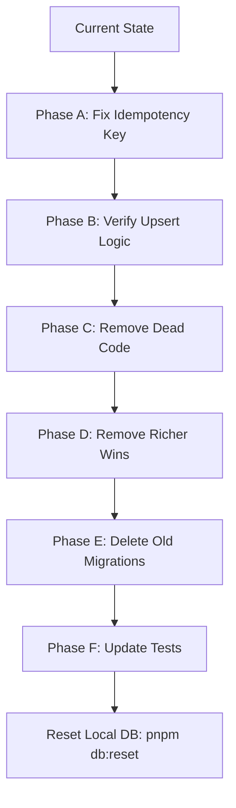

# Architecture Guardrails: PDF Exercise Deduplication

> Generated from `.tasks/pdf-conversion-improvements/cleanup-plan.md`. These guardrails ensure idempotent PDF→Exercises conversion.

## Comparison: Provided Plan vs These Guardrails

| Aspect | Provided Plan | These Guardrails |
|--------|---------------|------------------|
| **Format** | Markdown checklist with phases A-F | Structured reference document with tables |
| **Idempotency Key** | Specified format change | Documented with examples and forbidden patterns |
| **Files to Modify** | Listed in table | Expanded with line numbers and change summaries |
| **Migration Strategy** | Described textually | Added execution order and prerequisites |
| **Test Criteria** | Acceptance checklist | Added verification commands |
| **Forbidden Patterns** | Not explicitly called out | Added dedicated section with code examples |
| **What Stays/Removed** | Tables | Expanded with file paths and reasons |
| **Quick Reference** | Not included | Added command reference section |

## 1. Existing Functions to Reuse

| Function | Location | Purpose | Reuse Strategy |
|----------|----------|---------|---------------|
| `computeIdempotencyKey()` | `src/server/services/exercise-conversion/idempotency.ts:57` | Core key computation | **MODIFY** - change `itemOrdinal` source from LLM to system |
| `createIdempotencyKeyFn()` | `src/server/services/exercise-conversion/idempotency.ts:128` | Segment-scoped key factory | **MODIFY** - accept system ordinal parameter |
| `deduplicateByIdempotencyKey()` | `src/server/services/exercise-conversion/idempotency.ts:88` | In-memory dedup | **KEEP** - works correctly |
| `normalizeExerciseInput()` | `src/server/services/exercise-conversion/helpers.ts` | Hash computation prep | **KEEP** - used for contentHash |
| `computeContentHash()` | `src/server/utils/hash.ts` | Debug hash generation | **KEEP** - for observability only |
| `SPEC_VERSION` constant | `src/server/services/exercise-conversion/idempotency.ts:14` | Schema version tracking | **KEEP** - bump on contract changes |

## 2. Forbidden Patterns

```typescript
// ❌ FORBIDDEN: Using LLM-derived orderInSegment for identity
// The LLM can return exercises in different order on re-runs
// This causes idempotency key instability → duplicates
const key = computeIdempotencyKey({
  ...
  itemOrdinal: exercise.orderInSegment, // ❌ WRONG - LLM non-deterministic
})

// ❌ FORBIDDEN: Content-based deduplication
// Two identical exercises on different pages should be separate
// Use page range, not content similarity

// ❌ FORBIDDEN: Richer wins semantics
// Always use "Last Wins" - overwrite on upsert
// No content comparison logic

// ❌ FORBIDDEN: Local API without overrideAccess in jobs
// Job runs should use overrideAccess: true (admin privileges)
```

## 3. Infrastructure Constraints

| Constraint | Details |
|------------|---------|
| **Database** | MongoDB (Atlas) - replica set required for transactions |
| **Unique Index** | Sparse, unique index on `idempotencyKey` only |
| **Storage** | Vercel Blob for PDF files (no local filesystem) |
| **Transactions** | Hooks must pass `req` to nested operations |
| **Type Generation** | Run `pnpm generate:types` after schema changes |
| **Import Map** | Run `pnpm generate:importmap` after component changes |

## 4. Idempotency Key Format (CORRECTED)

```
Format: {tenantId}:{lessonId}:{sourceDocId}:{pageStart}-{pageEnd}:{systemOrdinal}:{specVersion}

Example: tenant123:lesson456:doc789:1-3:0:v1
                    ↑tenant   ↑lesson ↑doc   ↑pages ↑systemIdx ↑version
```

### Key Changes Required

- `systemOrdinal` = loop/index position (deterministic), NOT LLM `orderInSegment`
- `orderInSegment` stored as `sourceOrderInSegment` field (metadata only)
- `itemOrdinal` parameter in `computeIdempotencyKey()` must accept system ordinal (0-based or 1-based)

## 5. Migration Strategy



### Phase Execution Order

1. **Phase A** (A1-A3): Fix idempotency key computation
2. **Phase B** (B1-B3): Verify upsert logic is active
3. **Phase C** (C1-C3): Remove dead code
4. **Phase D** (D1): Ensure strict "Last Wins"
5. **Phase E** (E1-E3): Delete/rename migrations, reset DB
6. **Phase F** (F1-F3): Update tests

## 6. Files to Modify

| Action | File | Change Summary |
|--------|------|----------------|
| **EDIT** | `src/server/services/exercise-conversion/idempotency.ts` | Use system ordinal, not LLM `orderInSegment` |
| **EDIT** | `src/server/payload/jobs/pdf-to-exercises-task.ts:145` | Pass loop index to `createIdempotencyKeyFn` |
| **EDIT** | `src/infra/config/system-params.ts:92-95` | Remove `getPdfConversionUseIdempotencyUpsert()` |
| **DELETE** | `src/server/payload/migrations/001-create-conversion-indexes.ts` | Orphaned contentHash index |
| **DELETE** | `src/server/payload/migrations/003-add-exercise-unique-index.ts` | Wrong index definition |
| **DELETE** | `src/server/payload/migrations/005-drop-content-hash-unique-index.ts` | Targets wrong index |
| **RENAME** | `002-backfill-exercise-origin.ts` → `001-backfill-exercise-origin.ts` | Sequential numbering |
| **RENAME** | `003-create-media-retention-index.ts` → `002-create-media-retention-index.ts` | Sequential numbering |
| **RENAME** | `004-add-idempotency-key-index.ts` → `003-add-idempotency-key-index.ts` | Sequential numbering |
| **EDIT** | `tests/int/pdf-conversion-idempotency-upsert.int.spec.ts` | Use system ordinal in tests |
| **REGENERATE** | `src/payload-types.ts` | Via `pnpm generate:types` |

## 7. Database Index State

```bash
# Expected indexes after fix:
mongosh "mongodb://localhost:27017/payload"
db.exercises.getIndexes()
```

### SHOULD EXIST:
- `_id_` (default)
- `idx_exercise_idempotency_key_unique` (sparse, unique, on idempotencyKey)

### SHOULD NOT EXIST:
- `idx_exercise_dedup` (contentHash-based, orphaned)
- `idx_exercise_unique_identity` (lesson+sourceDoc+contentHash, orphaned)
- `idx_exercise_content_hash` (non-unique, debugging only - removed)

## 8. Job Output Metrics

```typescript
output: {
  exercisesCreated: number;   // New exercises (should be 0 on re-run)
  exercisesDeduped: number;   // Updated existing (should equal Created on first run)
  exercisesSkipped: number;   // Failed verification
  segmentsTotal: number;
  segmentsDone: number;
  segmentsFailed: number;
  errors: Array<{...}>;
  segments: Array<{
    index: number;
    pageStart: number;
    pageEnd: number;
    status: 'done' | 'failed';
    exercisesCreated: number;
    exercisesSkipped: number;
    debug: { proposedIdempotencyKeys: string[] };
  }>;
}
```

## 9. Test Acceptance Criteria

| Test | Expected Result | Command |
|------|-----------------|---------|
| Same PDF twice | `exercisesCreated = 0`, `exercisesDeduped = N` | Run job twice, compare metrics |
| contentHash field | Present for all converted exercises | `db.exercises.find({ origin: 'conversion' }, { contentHash: 1 })` |
| contentHash NOT identity | Same key, different content = update, not duplicate | Manual LLM output variation test |
| Dead code removed | No references to `_useIdempotencyUpsert` or `getPdfConversionUseIdempotencyUpsert` | `grep -r "getPdfConversionUseIdempotencyUpsert" src/` |
| Quality gates | All checks green | `pnpm typecheck && pnpm lint && pnpm test` |

## 10. Debugging Observability

```typescript
// Log format for correlation:
console.log(
  `[PDF→Exercises] Exercise idempotencyKey=${idempotencyKey}, ` +
  `contentHash=${contentHash}, title="${title}", ` +
  `orderInSegment=${orderInSegment}, systemOrdinal=${systemOrdinal}`
)
```

The `contentHash` is for debugging LLM variance; `idempotencyKey` is the source of truth for identity.

## 11. What Stays vs What Is Removed

### STAYS (Keep These)

| Item | File | Reason |
|------|------|--------|
| `contentHash` field | Exercises collection | Debug/change signal - NOT for dedup |
| `computeContentHash()` | `hash.ts` | Still computed for debugging |
| `normalizeExerciseInput()` | `helpers.ts` | Supports contentHash computation |
| contentHash in logs | `pdf-to-exercises-task.ts` | Useful for "same key, different content" detection |
| `idempotencyKey` field | Exercises collection | Primary dedup mechanism (FIXED) |
| `specVersion` field | Exercises collection | Version tracking |
| `extractionMeta` field | Exercises collection | Debug metadata |
| `origin` field | Exercises collection | Semantic marker for UI |
| `sourceDoc` | Exercises collection | PDF reference |
| `sourcePageStart/End` | Exercises collection | Page position |
| `sourceOrderInSegment` | Exercises collection | LLM ordering (metadata only) |
| `conversionJobId` | Exercises collection | Job tracking |
| `deduplicateByIdempotencyKey()` | `idempotency.ts` | In-memory dedup |

### REMOVED (Delete These)

| Item | File | Reason |
|------|------|--------|
| `_useIdempotencyUpsert` variable | `pdf-to-exercises-task.ts:119` | Declared but never used |
| `getPdfConversionUseIdempotencyUpsert()` | `system-params.ts` | Feature flag never checked |
| Import of above | `pdf-to-exercises-task.ts:4` | Dead import |
| Migration 001-create-conversion-indexes | `migrations/` | Creates orphaned contentHash indexes |
| Migration 003-add-exercise-unique-index | `migrations/` | Creates orphaned contentHash index |
| Migration 005-drop-content-hash-unique-index | `migrations/` | Targets wrong index names |
| Any "richer wins" comparison | `pdf-to-exercises-task.ts` | Merge is strictly "Last Wins" |

## 12. Key Insight: Why Duplicates Happened

### Current (BROKEN) Format:
```
{tenant}:{lesson}:{doc}:{pageStart}-{pageEnd}:{orderInSegment}:{specVersion}
```

The `orderInSegment` comes from LLM extraction output. If LLM returns exercises in different order on re-run:
- Run 1: Exercise A gets `orderInSegment=1` → key ends with `:1:v1`
- Run 2: Exercise A gets `orderInSegment=2` → key ends with `:2:v1`
- Different keys → no match → new exercise created → **DUPLICATE**

### FIXED Format:
```
{tenant}:{lesson}:{doc}:{pageStart}-{pageEnd}:{systemOrdinal}:{specVersion}
```

The `systemOrdinal` comes from array index (loop position) - deterministic regardless of LLM output order.

---

## Quick Reference Commands

```bash
# After modifications
pnpm generate:types              # Regenerate types
pnpm generate:importmap          # Regenerate import map
pnpm db:reset                    # Reset local database
pnpm typecheck && pnpm lint && pnpm test  # Quality gates

# Debugging
db.exercises.find({ origin: 'conversion' }, { idempotencyKey: 1, contentHash: 1, title: 1 })
db.exercises.getIndexes()
```
