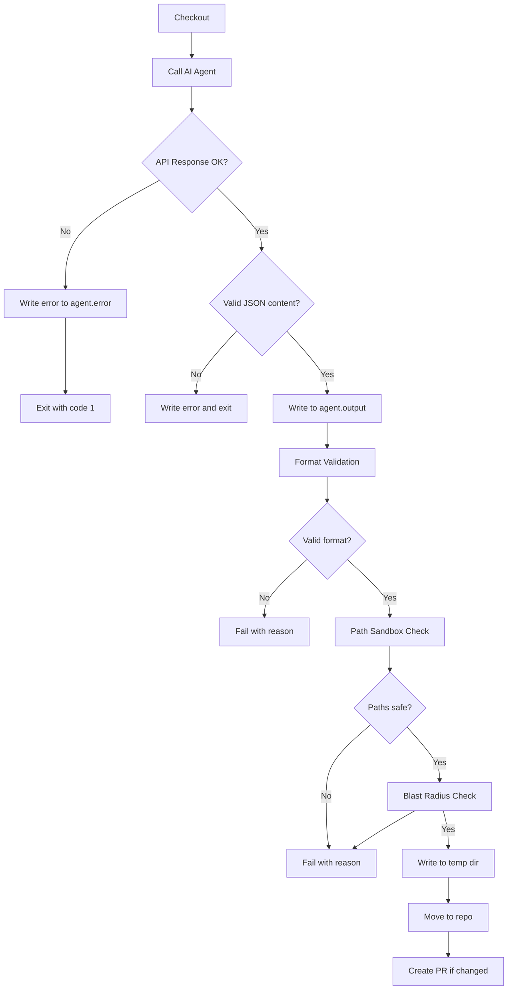

# Hardening Plan: Overwrite Agent Workflow

## Overview

This document outlines the security and robustness improvements for the `run-overwrite-agent` job in `.github/workflows/dev-agent-smith.yml`.

## Current Workflow Analysis

The current `run-overwrite-agent` job (lines 17-75) has these security issues:

| Issue | Location | Severity |
|-------|----------|----------|
| No HTTP response validation | `call-agent.mjs:46-52` | High |
| No format validation | `Apply changes:58-65` | High |
| Path traversal possible | `awk` command | Critical |
| Lockfile deletion | `rm -f ... pnpm-lock.yaml` | Medium |
| Direct file writes | `awk` command | Medium |
| No blast-radius limits | Entire job | Medium |

## Implementation Plan

### 1. Hardened `call-agent.mjs` Script

Replace the current AI call script with a robust version that:

- **Validates HTTP response**: Checks `res.ok` before parsing
- **Handles API errors**: Writes error to `agent.error` and exits with code 1
- **Validates JSON structure**: Asserts `data?.choices?.[0]?.message?.content` exists
- **Prevents empty responses**: Fails if content is empty or not a string

```javascript
// New call-agent.mjs structure
const res = await fetch(...);
if (!res.ok) {
  const errorText = await res.text().substring(0, 500);
  writeFileSync("agent.error", `API Error ${res.status}: ${errorText}`);
  console.error(`❌ API request failed: ${res.status} ${res.statusText}`);
  process.exit(1);
}
const data = await res.json();
const content = data?.choices?.[0]?.message?.content;
if (typeof content !== "string" || content.trim().length === 0) {
  writeFileSync("agent.error", "AI response empty or invalid format");
  console.error("❌ AI response validation failed");
  process.exit(1);
}
writeFileSync("agent.output", content, "utf8");
```

### 2. Format Validation Step

Add a dedicated validation step before applying changes:

```yaml
- name: Validate output format
  id: validate
  run: |
    # Check for at least one FILE: line
    if ! grep -q '^FILE: ' agent.output; then
      echo "❌ No FILE: markers found in output" >> "$GITHUB_OUTPUT"
      echo "validation_status=failed" >> "$GITHUB_OUTPUT"
      exit 1
    fi

    # Check for balanced FILE/END_FILE pairs
    file_count=$(grep -c '^FILE: ' agent.output)
    end_count=$(grep -c '^END_FILE$' agent.output)
    if [ "$file_count" -ne "$end_count" ]; then
      echo "❌ Unbalanced FILE/END_FILE: $file_count FILE vs $end_count END_FILE" >> "$GITHUB_OUTPUT"
      echo "validation_status=failed" >> "$GITHUB_OUTPUT"
      exit 1
    fi

    # Check each FILE block has CONTENT:
    awk '/^FILE: / { file=1; content=0 } /^CONTENT:/ { content=1 } /^END_FILE/ { if (!content) { print "Missing CONTENT: in block starting at line " NR; exit 1 }; file=0; content=0 } END { if (file) exit 1 }' agent.output || {
      echo "❌ Found FILE block without CONTENT:" >> "$GITHUB_OUTPUT"
      echo "validation_status=failed" >> "$GITHUB_OUTPUT"
      exit 1
    }

    # Reject markdown fences
    if grep -q '^```' agent.output; then
      echo "❌ Output contains markdown fences" >> "$GITHUB_OUTPUT"
      echo "validation_status=failed" >> "$GITHUB_OUTPUT"
      exit 1
    fi

    echo "validation_status=valid" >> "$GITHUB_OUTPUT"
    echo "file_count=$file_count" >> "$GITHUB_OUTPUT"
```

### 3. Path Sandboxing

Add path validation before writing files:

```yaml
- name: Validate and apply file paths
  id: apply
  run: |
    # Extract allowed tokens from comment
    COMMENT_BODY="${{ github.event.comment.body }}"
    ALLOW_WORKFLOWS=$(echo "$COMMENT_BODY" | grep -c '@agent-code allow:workflows' || true)
    ALLOW_ENV=$(echo "$COMMENT_BODY" | grep -c '@agent-code allow:env' || true)
    ALLOW_LOCKFILE=$(echo "$COMMENT_BODY" | grep -c '@agent-code allow:lockfile' || true)

    # Denylist (relative paths)
    DENYLIST_REGEX="\.env(\.[a-zA-Z0-9_-]+)?$|pnpm-lock\.yaml$|package\.json$"
    if [ "$ALLOW_ENV" -eq 0 ]; then
      DENYLIST_REGEX="$DENYLIST_REGEX|\.env"
    fi
    if [ "$ALLOW_LOCKFILE" -eq 0 ]; then
      DENYLIST_REGEX="$DENYLIST_REGEX|pnpm-lock\.yaml"
    fi
    if [ "$ALLOW_WORKFLOWS" -eq 0 ]; then
      DENYLIST_REGEX="$DENYLIST_REGEX|\.github/workflows/"
    fi

    # Create temp directory
    TEMP_DIR=".agent_tmp_$$"
    mkdir -p "$TEMP_DIR"

    # Process each FILE block
    awk -v temp_dir="$TEMP_DIR" -v denylist="$DENYLIST_REGEX" '
      /^FILE: / {
        file=$2;
        # Block path traversal
        if (file ~ /\.\./ || file ~ /^\\/ || file ~ /^[A-Za-z]:\\/ || file ~ /^\//) {
          print "❌ Blocked path traversal or absolute path: " file > "/dev/stderr"
          exit 1
        }
        # Block denylisted files
        if (denylist != "" && file ~ denylist) {
          print "❌ Blocked denylisted file: " file > "/dev/stderr"
          exit 1
        }
        # Create directory structure
        split(file, parts, "/");
        dir="";
        for (i=1; i<length(parts); i++) {
          dir = (dir == "" ? parts[i] : dir "/" parts[i]);
          system("mkdir -p " temp_dir "/" dir)
        }
        current_file = temp_dir "/" file
        next
      }
      /^CONTENT:/ { writing=1; next }
      /^END_FILE/ { writing=0; close(current_file); next }
      writing { print $0 >> current_file }
    ' agent.output

    if [ $? -ne 0 ]; then
      rm -rf "$TEMP_DIR"
      echo "❌ Path validation failed" >> "$GITHUB_OUTPUT"
      exit 1
    fi
```

### 4. Blast-Radius Limits

Add limits validation:

```yaml
# Add to validate step or before apply
- name: Check blast radius
  run: |
    # Max files: 10
    FILE_COUNT=$(grep -c '^FILE: ' agent.output)
    if [ "$FILE_COUNT" -gt 10 ]; then
      echo "❌ Too many files: $FILE_COUNT (max: 10)" >> "$GITHUB_OUTPUT"
      exit 1
    fi

    # Max total lines: 20000
    TOTAL_LINES=$(wc -l < agent.output)
    if [ "$TOTAL_LINES" -gt 20000 ]; then
      echo "❌ Too many lines: $TOTAL_LINES (max: 20000)" >> "$GITHUB_OUTPUT"
      exit 1
    fi

    # Max bytes: 500KB (approximately 512000 bytes)
    TOTAL_BYTES=$(wc -c < agent.output)
    if [ "$TOTAL_BYTES" -gt 512000 ]; then
      echo "❌ Output too large: $TOTAL_BYTES bytes (max: 512000)" >> "$GITHUB_OUTPUT"
      exit 1
    fi
```

### 5. Remove Lockfile Deletion

Change the cleanup line from:
```bash
rm -f call-agent.mjs agent.output pnpm-lock.yaml
```
To:
```bash
rm -f call-agent.mjs agent.output agent.error
rm -rf .agent_tmp_*
```

### 6. Safe Apply with Move Operation

Finalize the apply step:

```yaml
- name: Finalize changes
  run: |
    TEMP_DIR=".agent_tmp_$$"

    # Count files moved
    FILE_COUNT=$(find "$TEMP_DIR" -type f | wc -l)

    # Move files from temp to repo root
    cp -r "$TEMP_DIR"/* . 2>/dev/null || true
    rm -rf "$TEMP_DIR"

    # Cleanup
    rm -f call-agent.mjs agent.output agent.error

    echo "files_changed=$FILE_COUNT" >> "$GITHUB_OUTPUT"
    echo "changed=true" >> "$GITHUB_OUTPUT"
```

## Workflow Diagram



## Denylist Rules

| Path Pattern | Default | Allow Token |
|--------------|---------|-------------|
| `.env`, `.env.*` | Blocked | `@agent-code allow:env` |
| `pnpm-lock.yaml` | Blocked | `@agent-code allow:lockfile` |
| `.github/workflows/` | Blocked | `@agent-code allow:workflows` |
| `package.json` | Blocked | None |
| `tsconfig*.json` | Blocked | None |
| `.npmrc`, `.yarnrc*` | Blocked | None |

## Test Cases

| Test | Expected Result |
|------|-----------------|
| Invalid API key (401) | Job fails, error in logs |
| Empty AI response | Job fails, no files written |
| Missing `END_FILE` | Format validation fails |
| Markdown fences present | Format validation fails |
| `FILE: ../../etc/passwd` | Path sandbox blocks it |
| `FILE: /etc/passwd` | Path sandbox blocks it |
| 11 files requested | Blast radius fails |
| 25000 lines output | Blast radius fails |
| Modify `.env` without allow | Denylist blocks it |
| Modify `.env` with `allow:env` | Allowed |
| Modify `pnpm-lock.yaml` normally | Denylist blocks it |

## Files to Modify

1. `.github/workflows/dev-agent-smith.yml` - Main workflow file

## Acceptance Criteria Checklist

- [ ] API errors cause immediate failure with clear logs
- [ ] Invalid/malformed output never writes files
- [ ] Path traversal attempts are blocked
- [ ] Denylisted files are blocked by default
- [ ] Allow tokens work for workflows/env/lockfile
- [ ] Max 10 files limit enforced
- [ ] Max 20000 lines/500KB limit enforced
- [ ] Lockfile is never deleted
- [ ] All writes go through temp directory first
- [ ] Logs show number of files changed
